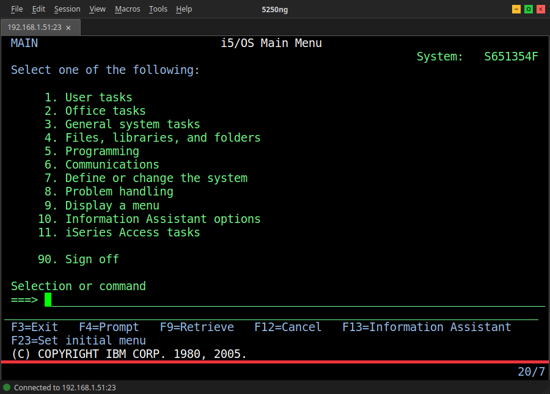
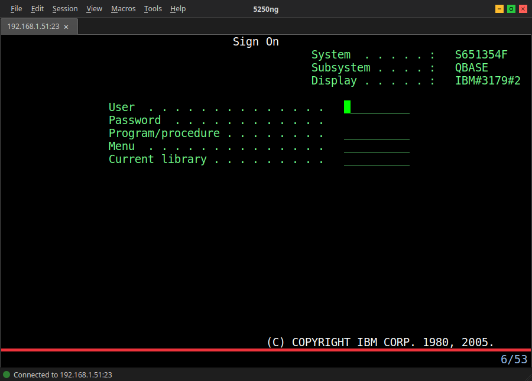

<p align="center">
  A modern TN5250 terminal emulator for connecting to IBM AS/400 and IBM i systems, built with Qt6 and C++17.
  <br>
  <a href="https://github.com/5250ng/5250ng/releases"></a>
  <a href="https://github.com/5250ng/5250ng/actions"></a>
  
  
  <a href="https://twitter.com/intent/follow?screen_name=podalirius_" title="Follow"></a>
  <a href="https://www.youtube.com/c/Podalirius_?sub_confirmation=1" title="Subscribe"></a>
  <br>
</p>

 

## Features

 - [x] Full TN5250 protocol ([RFC 1205](https://datatracker.ietf.org/doc/html/rfc1205)) with telnet option negotiation and TLS/SSL encryption
 - [x] Custom QPainter rendering with 24×80 and 27×132 modes
 - [x] CRT effects: scanline overlay, phosphor bloom, curvature vignette, and glow radius
 - [x] PF1-PF24 function keys, field navigation, and keyboard remapping
 - [x] Multi-tab sessions with persistent profiles (JSON), auto-connect, and per-session settings
 - [x] Scripting engine with `5250script` language:
    + [x] Record and playback macros with timing
    + [x] Convert recorded macros to editable 5250script code
    + [x] Screen inspection with `EXPECT`, `EXTRACT`, and `IF`/`WHILE` control flow
    + [x] User input prompts with `INPUT` and variable interpolation
    + [x] Functions, error handlers, and `GOTO` labels
 - [x] MCP server ([Model Context Protocol](https://modelcontextprotocol.io/)) exposing terminal tools over JSON-RPC 2.0:
    + [x] Screen reading, keystroke sending, cursor/field inspection
    + [x] Session management (create, list, close) and screenshot capture
    + [x] 5250script execution and generation
    + [x] Local file read/write/list operations
 - [x] AI assistant integration with OpenAI and Anthropic providers:
    + [x] API key and OAuth 2.0 authentication
    + [x] Configurable models and system prompts
    + [x] Natural language to 5250script generation
 - [x] 13 built-in terminal themes + user-defined themes with live preview
 - [x] Background image support with layout modes (stretch, tile, center, fit) and opacity control
 - [x] Screen overlays: cursor rules (crosshair), field protection, input field indicators, cell grid
 - [x] Code page support: `CP037`, `CP273`, `CP277`, `CP278`, `CP280`, `CP284`, `CP285`, `CP297`, `CP500`, `CP870`, `CP420`, `CP424`, `CP838`
 - [x] Hotspot detection, screen history/scrollback, regex match & replace, session logging
 - [x] Session logging with configurable verbosity (screens only, screens + keys, full protocol)
 - [x] Screenshot capture to PNG
 - [x] Cross-platform: Linux, macOS, and Windows

## Installation

### Linux (Ubuntu / Debian)

```bash
sudo apt install qt6-base-dev cmake g++ libxkbcommon-dev libssl-dev
cmake -S . -B build
cmake --build build
./build/bin/5250ng
```

### Mac OS

```bash
brew install qt cmake openssl
cmake -S . -B build
cmake --build build
./build/bin/5250ng.app/Contents/MacOS/5250ng
```

### Windows

**Prerequisites:** Install [Qt6](https://www.qt.io/download-qt-installer) (select a **MinGW** or **MSVC 2022** kit — Qt bundles CMake, Ninja, and MinGW automatically). For TLS, install [OpenSSL](https://slproweb.com/products/Win32OpenSSL.html) (Win64).

**Using `build.bat` (recommended):**

```cmd
git clone --recursive https://github.com/5250ng/5250ng.git
cd 5250ng
build.bat release
```

The script auto-detects Qt6, CMake, Ninja, and the compiler from common install paths. Run `build.bat help` for all options (`clean`, `test`, `package`). To create a distributable folder with all Qt DLLs bundled, run `build.bat package`.

**Manual CMake (MinGW example):**

```cmd
set PATH=C:\Qt\Tools\CMake_64\bin;C:\Qt\Tools\Ninja;C:\Qt\Tools\mingw1310_64\bin;%PATH%
cmake -G "Ninja" -S . -B build -DCMAKE_BUILD_TYPE=Release -DCMAKE_PREFIX_PATH=C:\Qt\6.10.2\mingw_64
cmake --build build
.\build\bin\5250ng.exe
```

> **TLS support** requires Qt6 SSL libraries. On Debian/Ubuntu: `sudo apt install libqt6network6 libssl-dev` then rebuild.

## Usage

```
$ 5250ng -h
5250ng [options]

Options:
  -H, --host <hostname>            Host to connect to (auto-connects at startup)
  -p, --port <port>                Port number (default: 23)
  --tls                            Use TLS/SSL encryption
  -s, --load-session-from-name     Load a saved session by name
  -f, --load-session-from-file     Load a session from a JSON file
  --enable-mcp-server              Enable the MCP server on startup
  --mcp-server-port <port>         MCP server port (default: 9250)
  -d, --debug                      Enable debug output
  -h, --help                       Show help
  -v, --version                    Show version
```

 + Auto-connect to a server:

    ```
    ./build/bin/5250ng --host as400.example.com
    ```

 + Connect with TLS on port 992:

    ```
    ./build/bin/5250ng --host as400.example.com --port 992 --tls
    ```

 + Load a saved session profile:

    ```
    ./build/bin/5250ng --load-session-from-name "Production AS400"
    ```

 + Start with the MCP server enabled:

    ```
    ./build/bin/5250ng --enable-mcp-server --mcp-server-port 9250
    ```

 + Launch the GUI and use the connect dialog:

    ```
    ./build/bin/5250ng
    ```

## Example

<details>
<summary><strong>Themes</strong></summary>

5250ng ships with 13 terminal themes. Switch themes instantly from the menu or per-session settings.

| Theme | Style |
|-------|-------|
| `amber_phosphor` | Classic amber CRT |
| `blue_terminal` | Blue-on-black retro |
| `classic_green` | IBM 3270-style green screen |
| `classic_white` | White terminal |
| `dracula` | Dark with purple/red accents |
| `high_contrast` | Accessibility-focused |
| `ibm_3179` | Faithful IBM 3179 color display |
| `ibm_infowindow_ii` | IBM InfoWindow II emulation |
| `matrix` | Green Matrix style |
| `modern_dark` | Contemporary dark |
| `monokai` | Developer-friendly dark |
| `nord` | Arctic north-bluish palette |
| `solarized_dark` | Solarized dark scheme |

You can also create your own themes by adding JSON files to the themes directory.

</details>

<details>
<summary><strong>Macro Recording & Playback</strong></summary>

Record keystroke sequences with timing, assign hotkeys, and replay them. Macros are saved as JSON and can be imported/exported between installations.

</details>

<details>
<summary><strong>IFS File Transfer</strong></summary>

Browse, upload, and download files from the IBM i Integrated File System (IFS). Supports directory listing, file operations, and progress tracking.

</details>

<details>
<summary><strong>Multi-Session Tabs</strong></summary>

Open multiple connections in tabs. Each session has its own settings, theme, and connection profile. Sessions can be duplicated, renamed, and persist across restarts.

</details>

<details>
<summary><strong>Hotspot Detection</strong></summary>

Automatically detects clickable elements on screen - function key labels (F3=Exit), menu options, and URLs - and makes them clickable.

</details>

<details>
<summary><strong>MCP Server & AI Integration</strong></summary>

5250ng includes a built-in [Model Context Protocol](https://modelcontextprotocol.io/) (MCP) server that exposes terminal tools over JSON-RPC 2.0, enabling AI agents to interact with AS/400 sessions programmatically. Tools include screen reading, keystroke sending, session management, screenshot capture, and 5250script execution.

The integrated AI assistant supports OpenAI and Anthropic providers with API key or OAuth 2.0 authentication. It can generate 5250script from natural language descriptions and execute it on the terminal.

</details>

<details>
<summary><strong>CRT Effects</strong></summary>

Recreate the look of vintage CRT monitors with configurable effects: scanline overlay, phosphor bloom (per-character glow), CRT curvature vignette, and adjustable glow radius. Effects can be tuned per-session or per-theme.

</details>

<details>
<summary><strong>Screen Overlays</strong></summary>

Toggle visual overlays for debugging and navigation: cursor rules (crosshair showing current row/column), field protection indicators, input field highlights, and cell grid lines.

</details>

## Contributing

Pull requests are welcome. Feel free to open an issue if you want to add other features.

## Credits

 - [@p0dalirius](https://github.com/p0dalirius) for developing 5250ng
